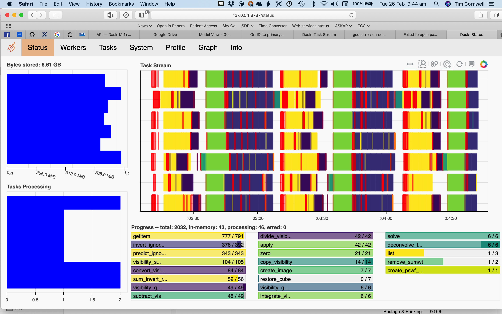

RASCIL and DASK
***************

RASCIL uses Dask for distributed processing:

    http://dask.pydata.org/en/latest/

    https://github.com/dask/dask-tutorial

Running RASCIL and Dask on a single machine is straightforward. First define a graph and then compute it either by
calling the compute method of the graph or by passing the graph to a dask client.

A typical graph will flow from a set of input visibility sets to an image or set of images. In the course
of constructing a graph, we will need to know the data elements and the functions transforming brtween them.
These are well-modeled in RASCIL.

In order that Dask.delayed processing can be switched on and off, and that the same code is used for Dask and
non-Dask processing, we have wrapped Dask.delayed in :py:func:`rascil.workflows.rsexecute.execution_support`.
An example is::

        rsexecute.set_client(use_dask=True)
        continuum_imaging_list = \
            continuum_imaging_list_rsexecute_workflow(vis_list, model_imagelist=self.model_imagelist, context='2d',
                                        algorithm='mmclean', facets=1,
                                        scales=[0, 3, 10],
                                        niter=1000, fractional_threshold=0.1,
                                        nmoments=2, nchan=self.freqwin,
                                        threshold=2.0, nmajor=5, gain=0.1,
                                        deconvolve_facets=8, deconvolve_overlap=16,
                                        deconvolve_taper='tukey')
        clean, residual, restored = rsexecute.compute(continuum_imaging_list, sync=True)

By default, rsexecute is initialised to use the Dask process scheduler with one worker per core. This can be
changed by a call to rsexecute.set_client::

        rsexecute.set_client(use_dask=True, nworkers=4)

If use_dask is True then a Dask graph is constructed via calls to rsexecute.execute() for subsequent execution.

If use_dask is False then the named function is called immediately, and the execution is therefore single threaded::

        rsexecute.set_client(use_dask=False)

The pipeline workflow
:py:func:`rascil.workflows.rsexecute.pipelines.continuum_imaging_list_rsexecute_workflow` is itself assembled using the
execution framework (an interface to Dask): :py:func:`rascil.workflows.rsexecute.execution_support`.

The functions for creating graphs are:

* Calibrate workflow: :py:func:`rascil.workflows.rsexecute.calibration.calibrate_list_rsexecute_workflow`
* Invert: :py:func:`rascil.workflows.rsexecute.imaging.invert_list_rsexecute_workflow`
* Predict: :py:func:`rascil.workflows.rsexecute.imaging.predict_list_rsexecute_workflow`
* Deconvolve: :py:func:`rascil.workflows.rsexecute.imaging.deconvolve_list_rsexecute_workflow`
* ICAL: :py:func:`rascil.workflows.rsexecute.pipelines.ical_list_rsexecute_workflow`
* Continuum imaging: :py:func:`rascil.workflows.rsexecute.pipelines.continuum_imaging_list_rsexecute_workflow`
* Spectral line imaging: :py:func:`rascil.workflows.rsexecute.pipelines.spectral_line_imaging_list_rsexecute_workflow`
* MPCCAL: :py:func:`rascil.workflows.rsexecute.pipelines.mpccal_skymodel_list_rsexecute_workflow`
* Testing and simulation support: :py:func:`rascil.workflows.rsexecute.simulation.simulate_list_rsexecute_workflow`

In addition there are notebooks that use components in workflows/notebooks.

.. toctree::
   :titlesonly:

   examples/notebooks/imaging-wterm_rsexecute.rst
   examples/notebooks/simple-dask_rsexecute.rst
   examples/notebooks/imaging-pipelines_rsexecute.rst
   examples/notebooks//bandpass-calibration_rsexecute.rst

These notebooks are scaled to run on a 2017-era laptop (4 cores, 16GB) but can be changed to larger scales. Both
explicitly create a client and output the URL (usually http://127.0.0.1:8787) for the Dask diagnostics. Of these the
status page is most useful, but the other pages are each worth investigating.

Using RASCIL and Dask on a cluster
==================================

Running on a cluster is a bit more complicated. On a single node, Dask/rsexecute use a process-oriented
scheduler. On a cluster, it is necessary to use the distributed scheduler.

You can start the distributed scheduler and workers by hand, using the dask-ssh command (more below). To
communicate the IP address of the scheduler, set the environment variable RASCIL_DASK_SCHEDULER appropriately::

    export RASCIL_DASK_SCHEDULER=192.168.2.10:8786

If you do this, remember to start the workers as well. dask-ssh is useful for this::

    c=get_dask_client(timeout=30)
    rsexecute.set_client(c)

get_dask_client will look for a scheduler via the environment variable RASCIL_DASK_SCHEDULER. It that does not exist, it will start a Client using the default Dask approach but that will be a single node scheduler.

Darwin and P3 uses SLURM for scheduling. There is python binding of DRMAA that could in principle be used to
queue the processing. However a simple edited job submission script is also sufficient.

On P3, each node has 16 cores, and each core has 8GB. Usually this is sometimes insufficient for RASCIL and so some cores must be not used so the memory can be used by other cores. To run 8 workers and one scheduler on 8 nodes, the SLURM batch file should look something like::

    #!/bin/bash
    #!
    #! Dask job script for P3
    #! Tim Cornwell
    #!
    #! Name of the job:
    #SBATCH -J IMAGING
    #! Which project should be charged:
    #SBATCH -A SKA-SDP
    #! How many whole nodes should be allocated?
    #SBATCH --nodes=8
    #! How many (MPI) tasks will there be in total? (<= nodes*16)
    #SBATCH --ntasks=8
    #! Memory limit: P3 has roughly 107GB per node
    #SBATCH --mem 107000
    #! How much wallclock time will be required?
    #SBATCH --time=23:59:59
    #! What types of email messages do you wish to receive?
    #SBATCH --mail-type=FAIL,END
    #! Where to send email messages
    #SBATCH --mail-user=realtimcornwell@gmail.com
    #! Uncomment this to prevent the job from being requeued (e.g. if
    #! interrupted by node failure or system downtime):
    ##SBATCH --no-requeue
    #! Do not change:
    #SBATCH -p compute

    #SBATCH --exclusive

    #! Modify the settings below to specify the application's environment, location
    #! and launch method:

    #! Optionally modify the environment seen by the application
    #! (note that SLURM reproduces the environment at submission irrespective of ~/.bashrc):
    module purge                               # Removes all modules still loaded

    #! Set up python
    # . $HOME/alaska-venv/bin/activate
    export PYTHONPATH=$PYTHONPATH:$ARL
    echo "PYTHONPATH is ${PYTHONPATH}"

    echo -e "Running python: `which python`"
    echo -e "Running dask-scheduler: `which dask-scheduler`"

    cd $SLURM_SUBMIT_DIR
    echo -e "Changed directory to `pwd`.\n"

    JOBID=${SLURM_JOB_ID}
    echo ${SLURM_JOB_NODELIST}

    #! Create a hostfile:
    scontrol show hostnames $SLURM_JOB_NODELIST | uniq > hostfile.$JOBID

    scheduler=$(head -1 hostfile.$JOBID)
    hostIndex=0
    for host in `cat hostfile.$JOBID`; do
        echo "Working on $host ...."
        if [ "$hostIndex" = "0" ]; then
            echo "run dask-scheduler"
            ssh $host dask-scheduler --port=8786 &
            sleep 5
        fi
        echo "run dask-worker"
        ssh $host dask-worker --nprocs 1 --nthreads 8 --interface ib0 \
        --memory-limit 256GB --local-directory /mnt/storage-ssd/tim/dask-workspace/${host} $scheduler:8786  &
            sleep 1
        hostIndex="1"
    done
    echo "Scheduler and workers now running"

    #! We need to tell dask Client (inside python) where the scheduler is running
    export ARL_DASK_SCHEDULER=${scheduler}:8786
    echo "Scheduler is running at ${scheduler}"

    CMD="python ../clean_ms_noniso.py --ngroup 1 --nworkers 0 --weighting uniform --context wprojectwstack --nwslabs 9 \
    --mode pipeline --niter 1000 --nmajor 3 --fractional_threshold 0.2 --threshold 0.01 \
    --amplitude_loss 0.02 --deconvolve_facets 8 --deconvolve_overlap 16 --restore_facets 4 \
    --msname /mnt/storage-ssd/tim/Code/sim-low-imaging/data/noniso/GLEAM_A-team_EoR1_160_MHz_no_errors.ms \
    --time_coal 0.0 --frequency_coal 0.0 --channels 0 1 \
    --use_serial_invert True --use_serial_predict True --plot False --fov 2.5 --single False | tee clean_ms.log"

    eval $CMD

In the command CMD remember to shutdown the Client so the batch script will close the background dask-ssh and then exit.

Thw diagnostic pages can be tunneled. RASCIL emits the URL of the diagnostic page. For example::

      http://10.143.1.25:8787

Then to tunnel the pages::

      ssh hpccorn1@login.hpc.cam.ac.uk -L8080:10.143.1.25:8787

The diagnostic page is available from your local browser at::

      127.0.0.1:8080

Logging
=======

Logging is difficult when using distributed processing. Here's a solution that works. At the beginning of your script or notebook, define a function to initialize the logger::

    def init_logging():
        log.info("Logging to %s/clean_ms_dask.log" % cwd)
        logging.basicConfig(filename='%s/clean_ms_dask.log' % cwd,
                            filemode='a',
                            format='%(thread)s %(asctime)s.%(msecs)d %(name)s %(levelname)s %(message)s',
                            datefmt='%H:%M:%S',
                            level=logging.DEBUG)

    log = logging.getLogger()
    log.setLevel(logging.INFO)
    log.addHandler(logging.StreamHandler(sys.stdout))
    log.addHandler(logging.StreamHandler(sys.stderr))
    init_logging()
    ...
    rsexecute.run(init_logging)

To ensure that the Dask workers get the same setup, you will need to run init_logging() on each worker using the
rsexecute.run() function::

    rsexecute.run(init_logging)

or::

    rsexecute.set_client(use_dask=True)
    rsexecute.run(init_logging)

This will log to the same file. It is also possible to set up separate log file per worker by suitably changing init_logger.

